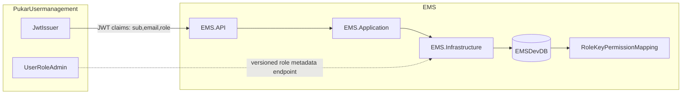

# EMS-UserManagement Decoupling Implementation Plan

## Execution Progress

- [x] A1 Define and publish auth contract v1
- [x] A2 Enforce claim emission consistency
- [x] A3 Add versioned role metadata read endpoint
- [x] A4 Add UM compatibility test pack
- [x] B1 Add EMS role-key permission model (additive migration)
- [x] C1 Introduce identity and evaluator abstractions
- [x] D1 Implement claims identity adapter
- [x] D2 Implement role-key permission repository/evaluator path
- [x] E1 Initial DI wiring for evaluator + mode resolver
- [x] C2/E1 Navigation dual-path (role-key + legacy fallback) integrated behind flags
- [x] B2 Backfill strategy/script (idempotent SQL + runbook)
- [x] D3 UM role metadata client in EMS
- [x] F1 Dual-read telemetry/parity reports (fallback/mismatch counters + admin report endpoint)
- [x] E2 Hosted service decoupling from UM role-id assumptions
- [ ] F2/F3 production cutover and cleanup

## Scope and Goal
Decouple EMS runtime authorization and bootstrap flows from direct `Pukar.Usermanagement` table/repository dependency, while preserving your architecture rules:
- Layering (`API -> Application -> Domain`, Infrastructure implements abstractions)
- Thin controllers
- DTO boundaries
- DI only in API composition root

The end state keeps `Pukar.Usermanagement` as identity authority (JWT issuing and user/role management), and EMS as permission-policy owner for EMS features.

## Direct answer: Do we need changes in Pukar.Usermanagement?
- **Yes (mandatory now):** include a small, controlled set of UM changes so EMS decoupling has a stable contract and future-proof sync path.
- Required UM outcomes in this plan:
  - harden and document JWT claim contract (`sub`, `email`, normalized `role`/`roles`)
  - add a versioned read-only role metadata endpoint for EMS sync/parity checks
  - add tests proving claim and endpoint contract stability

## Current Coupling to Remove (EMS side)
- EMS hosted services and providers currently depend on UM repositories and UM role ids.
- EMS permission model currently assumes UM role-id coupling in places.
- Startup seed behavior expects UM role rows at runtime.

## Target Architecture (Phased)

## Implementation Phases

### Phase 0 - Contracts and Safeguards
- Freeze identity claim contract used by EMS authz (`sub`, role claim type, normalization).
- Add rollout flags (design-only now):
  - `Authorization:UseRoleKeyMapping`
  - `Authorization:EnableLegacyRoleIdFallback`
- Define permission parity criteria before cutover.
- Define UM contract version marker for claims/endpoint payload (`authz_contract_version` in docs/spec).

### Phase 0.5 - Mandatory Pukar.Usermanagement Contract Hardening
- Ensure UM-issued tokens consistently include required claims for EMS (`sub`, `email`, normalized roles).
- Publish and enforce UM-side contract documentation and fixtures used by EMS tests.
- Add read-only endpoint in UM for role metadata (id, normalized name/key, display name, system flag) with versioned response shape.
- Add UM tests for:
  - claim emission consistency
  - endpoint payload schema and version compatibility
  - backward-compatible behavior on empty/seeded role sets

### Phase 1 - EMS Domain Expansion (Non-breaking)
- Add EMS-owned role-key based permission mapping model (new tables/entities).
- Keep legacy role-id based structures temporarily.
- Add migration that is additive only.

### Phase 2 - EMS Application Abstractions
- Introduce abstractions for identity and permission evaluation:
  - `IIdentityContext`
  - `IPermissionEvaluator`
- Refactor application use cases to prefer role-key evaluation.
- Keep temporary fallback path behind abstraction and flag.

### Phase 3 - EMS Infrastructure Adapters
- Implement claims-backed identity adapter.
- Implement repositories for EMS-owned permission mapping.
- Isolate legacy path into one adapter (temporary).
- Add UM API client adapter (read-only role metadata) for parity tooling and reconciliation paths.

### Phase 4 - EMS API Composition and Startup Refactor
- Replace UM-repository-coupled providers/hosted startup flows with EMS-owned role-key logic.
- Ensure authorization policies resolve through `IPermissionEvaluator`.
- Keep controllers thin and unchanged in responsibility.

### Phase 5 - Backfill and Dual-read Rollout
- Backfill new role-key mappings from current effective permissions.
- Enable dual-read:
  1. new role-key mapping
  2. legacy fallback
- Add telemetry counters for fallback and mismatch events.
- Run UM endpoint parity checks during rollout to detect drift between claim roles and role metadata.

### Phase 6 - Cutover and Cleanup
- Switch to new mapping as primary path.
- After stability window, disable fallback.
- Remove legacy coupling code and schema.

## Project-by-Project Checklist

### EMS.Domain
- Add role-key permission binding entities + EF configurations.
- Add additive migration.
- Add final cleanup migration after cutover.

### EMS.Application
- Add identity/permission interfaces.
- Update services to evaluate by role keys.
- Keep DTOs flat and area grouped.

### EMS.Infrastructure
- Implement claim principal adapter.
- Implement permission mapping repositories.
- Keep temporary legacy adapter for transition.

### EMS.API
- Wire DI for new abstractions.
- Refactor seeded startup flows to avoid UM direct role-id dependencies.
- Route authorization decisions through evaluator service.

### ems-web
- No required architecture change for decoupling core.
- Run regression checks for menu visibility/organization setup.

### Pukar.Usermanagement
- **Required now (mandatory in this plan):**
  - claim contract hardening and documentation
  - versioned read-only role metadata endpoint
  - contract and compatibility tests
- **Not required now:** no UM data-model redesign or breaking API changes.

## Validation and Exit Criteria
- EMS runs with `UserManagement` and `DefaultConnection` split databases.
- EMS authorization works without UM table reads during request processing.
- No regression in role/menu access behavior.
- Fallback telemetry reaches zero for agreed stability period.
- UM claim contract and role metadata endpoint pass compatibility tests consumed by EMS.

## Risk Controls
- Use feature flags for reversible rollout.
- Keep dual-read until parity proven.
- Avoid removing legacy schema before telemetry is stable.

## Sequence Constraints
- Do not cut over before additive schema + abstraction layers are in place.
- Do not remove legacy coupling before fallback usage is zero.
- Complete UM mandatory contract hardening before enabling EMS cutover flag in production.

## Detailed Implementation Tickets

### Epic A - UM Contract Hardening (Mandatory)

#### A1 - Define and publish auth contract v1
- **Project:** `Pukar.Usermanagement`
- **Scope:** Document stable JWT claims and role normalization rules.
- **Deliverables:**
  - contract doc with required claims (`sub`, `email`, `role`/`roles`)
  - canonical normalization rules for roles
  - compatibility notes for EMS consumers
- **Acceptance criteria:**
  - contract doc approved by EMS + UM owners
  - contract version id included in docs and release notes

#### A2 - Enforce claim emission consistency
- **Project:** `Pukar.Usermanagement`
- **Scope:** Ensure token generation emits required claims consistently across login/refresh paths.
- **Deliverables:**
  - unified claim-building path
  - automated tests for required claims presence and normalization
- **Acceptance criteria:**
  - tests pass for login and refresh token flows
  - no path emits missing/unnormalized role claims

#### A3 - Add versioned role metadata read endpoint
- **Project:** `Pukar.Usermanagement.API`
- **Scope:** Provide read-only endpoint for role metadata used by EMS parity/sync checks.
- **Deliverables:**
  - endpoint contract (`id`, normalized key/name, display name, `isSystem`)
  - versioned response model
  - authorization and rate-limit decision documented
- **Acceptance criteria:**
  - endpoint available in non-dev and dev with documented auth behavior
  - contract tests verify response shape and backward compatibility

#### A4 - UM compatibility test pack
- **Project:** `Pukar.Usermanagement`
- **Scope:** Add tests acting as consumer contract guardrails.
- **Deliverables:**
  - golden payload fixtures
  - compatibility tests for claim and endpoint contracts
- **Acceptance criteria:**
  - CI fails on breaking contract changes
  - fixtures versioned and traceable to contract v1

### Epic B - EMS Domain and Data Model Decoupling

#### B1 - Add EMS role-key permission model (additive)
- **Project:** `EMS.Domain`
- **Scope:** Introduce role-key-based authorization entities/configuration.
- **Deliverables:**
  - new entities and EF configuration
  - additive migration
  - indexes/uniqueness for normalized keys
- **Acceptance criteria:**
  - migration applies on existing DB without breaking current runtime
  - schema supports role-key mapping without UM role-id FK dependency

#### B2 - Backfill design and migration script
- **Project:** `EMS.Domain` + operational migration scripts
- **Scope:** Define deterministic mapping from legacy role-id permissions to role-key permissions.
- **Deliverables:**
  - migration/backfill strategy doc
  - executable backfill script or migration step
- **Acceptance criteria:**
  - idempotent backfill
  - validation query/report for parity completeness

### Epic C - EMS Application Refactor

#### C1 - Introduce identity and evaluator abstractions
- **Project:** `EMS.Application`
- **Scope:** Add abstractions for caller identity and permission evaluation.
- **Deliverables:**
  - `IIdentityContext`
  - `IPermissionEvaluator`
  - interface-level tests (if test project exists)
- **Acceptance criteria:**
  - Application layer has no UM repository dependency for authz logic
  - abstractions support both new and legacy evaluation paths during transition

#### C2 - Refactor authorization use cases to role keys
- **Project:** `EMS.Application`
- **Scope:** Move permission logic from role-id assumptions to role-key evaluation.
- **Deliverables:**
  - updated services/use-cases
  - fallback behavior behind feature flags
- **Acceptance criteria:**
  - functional parity with current permission outcomes under dual-read mode
  - no controller responsibility creep

### Epic D - EMS Infrastructure Integration

#### D1 - Claims identity adapter
- **Project:** `EMS.Infrastructure` / API-facing adapter layer
- **Scope:** Implement `IIdentityContext` using authenticated principal claims.
- **Deliverables:**
  - claim parsing + normalization adapter
  - validation handling for missing claims
- **Acceptance criteria:**
  - adapter returns stable normalized role keys
  - missing-claim behavior is deterministic and logged

#### D2 - Role-key permission repositories
- **Project:** `EMS.Infrastructure`
- **Scope:** Implement persistence adapters for new authorization model.
- **Deliverables:**
  - repository implementations
  - query paths for evaluator
- **Acceptance criteria:**
  - query performance acceptable for request-time checks
  - supports dual-read transition mode

#### D3 - UM role metadata client (mandatory support path)
- **Project:** `EMS.Infrastructure`
- **Scope:** Read-only client for UM role metadata endpoint for parity and reconciliation tooling.
- **Deliverables:**
  - typed client + error handling
  - retry/backoff policy and timeout defaults
- **Acceptance criteria:**
  - non-blocking behavior when UM endpoint unavailable (no request-path hard dependency unless explicitly enabled)
  - observability on endpoint failures

### Epic E - EMS API Composition and Startup Cleanup

#### E1 - DI and policy wiring updates
- **Project:** `EMS.API`
- **Scope:** Wire new abstractions and evaluators in composition root.
- **Deliverables:**
  - DI registrations
  - policy/evaluator mapping
- **Acceptance criteria:**
  - protected endpoints use evaluator path
  - no direct UM repo injection in EMS authorization flow

#### E2 - Hosted service decoupling
- **Project:** `EMS.API`
- **Scope:** Refactor startup seed/bootstrap jobs to remove UM role-id runtime dependency.
- **Deliverables:**
  - EMS-only seed path for menus/permissions
  - role-key oriented bootstrap behavior
- **Acceptance criteria:**
  - EMS startup succeeds without direct UM table reads for seed logic
  - seed remains idempotent

### Epic F - Rollout, Observability, and Cleanup

#### F1 - Dual-read feature-flag rollout
- **Project:** EMS runtime configuration
- **Scope:** Enable new mapping with legacy fallback and telemetry.
- **Deliverables:**
  - fallback counters
  - mismatch counters
  - dashboard/queries for rollout monitoring
- **Acceptance criteria:**
  - parity reports show no unexpected divergence before cutover

#### F2 - Production cutover
- **Project:** EMS deployment/runtime config
- **Scope:** Promote role-key mapping to primary path after parity window.
- **Deliverables:**
  - cutover checklist
  - rollback checklist
- **Acceptance criteria:**
  - zero critical auth regressions
  - rollback verified in staging rehearsal

#### F3 - Legacy removal
- **Project:** `EMS.Domain`, `EMS.Application`, `EMS.Infrastructure`, `EMS.API`
- **Scope:** Remove legacy role-id coupling code/schema after sustained stability.
- **Deliverables:**
  - cleanup migration
  - removed fallback logic and flags
- **Acceptance criteria:**
  - no legacy path references in codebase
  - operational docs updated

## Dependency Order (Execution Graph)

1. `A1 -> A2 -> A3 -> A4`
2. `A1` is required before `C1`, `D1`, and `E1` finalize.
3. `B1` must complete before `C2` and `D2`.
4. `C1` and `D1` can run in parallel after `A1`.
5. `E1` depends on `C1 + D1 + D2`.
6. `E2` depends on `C2 + D2`.
7. `B2 + D3 + E1 + E2` must complete before `F1`.
8. `F2` depends on stable `F1` telemetry window.
9. `F3` depends on successful `F2` soak period.

## Suggested Implementation Slices (Step-by-Step)

### Slice 1 (Contract foundation)
- Complete `A1`, `A2`.
- Freeze claim contract and normalization.

### Slice 2 (UM read contract)
- Complete `A3`, `A4`.
- Publish endpoint and compatibility tests.

### Slice 3 (EMS schema + abstractions)
- Complete `B1`, `C1`.
- Keep behavior unchanged.

### Slice 4 (Adapters + policy wiring)
- Complete `D1`, `D2`, `E1`.
- Introduce evaluator-based checks with fallback disabled by default.

### Slice 5 (Seed/bootstrap decoupling)
- Complete `C2`, `E2`.
- Remove startup/runtime UM role-id assumptions.

### Slice 6 (Backfill + parity)
- Complete `B2`, `D3`, `F1`.
- Run dual-read and parity telemetry.

### Slice 7 (Cutover + cleanup)
- Complete `F2`, then `F3`.
- Remove legacy coupling and finalize docs.

## Ticket Template (Use for each task)

- **Title:** `EPIC-ID short-action`
- **Owner:** EMS or UM team
- **Prerequisites:** explicit ticket IDs
- **Files/Areas:** project + key folders
- **Acceptance criteria:** measurable behavior
- **Rollback:** config-only or code rollback path
- **Risk level:** low/medium/high

## Scope Lock: First 2 Sprints (Strict)

This section defines the only allowed work for Sprint 1 and Sprint 2. Any additional items are deferred unless explicitly approved.

### Sprint 1 (Foundation, No Behavioral Cutover)

#### In scope (must complete)
- `A1` Define and publish auth contract v1.
- `A2` Enforce claim emission consistency.
- `B1` Add EMS role-key permission model (additive schema only).
- `C1` Introduce `IIdentityContext` and `IPermissionEvaluator` abstractions.

#### Out of scope (explicitly deferred)
- No production cutover.
- No legacy path removal.
- No UM data model redesign.
- No web UX redesign.
- No mandatory UM endpoint consumption in EMS request path.

#### Sprint 1 entry gates
- Existing build green for EMS and UM.
- Environment config documented for split DB (`DefaultConnection` vs `UserManagement`).

#### Sprint 1 exit criteria
- UM claim contract and tests merged.
- EMS additive migration merged and deployable.
- EMS Application abstractions merged without controller-layer responsibility changes.
- Feature flags present but cutover remains disabled.

#### Sprint 1 deliverables
- Contract document versioned (`v1`).
- Additive DB migration script.
- Interface and adapter scaffolding merged.
- Basic observability fields defined (no rollout dashboard required yet).

### Sprint 2 (Integration and Shadow Validation)

#### In scope (must complete)
- `A3` Add versioned UM role metadata read endpoint.
- `A4` Add UM compatibility test pack.
- `D1` Implement claims identity adapter.
- `D2` Implement role-key permission repositories.
- `E1` DI and policy wiring updates.
- `F1` Dual-read rollout in non-production with telemetry and parity checks.

#### Out of scope (explicitly deferred)
- No production flag flip.
- No cleanup migration.
- No deletion of legacy fallback code.
- No broad cross-service synchronization beyond read-only UM endpoint.

#### Sprint 2 entry gates
- Sprint 1 exit criteria fully met.
- Staging environment available with representative auth data.

#### Sprint 2 exit criteria
- Protected endpoints exercise evaluator path in staging.
- Dual-read parity report available and reviewed.
- UM endpoint contract tests integrated into CI.
- No P0/P1 auth regressions in staging smoke/regression.

#### Sprint 2 deliverables
- UM versioned endpoint + docs.
- EMS evaluator path running in staging with fallback enabled.
- Telemetry queries/report for mismatch and fallback rates.
- Go/No-Go checklist for Sprint 3 production cutover.

## Not Before Sprint 3

- `F2` Production cutover.
- `F3` Legacy removal and cleanup migration.

## Governance Rules for Scope Control

- Any new task must map to an existing ticket ID (`A1..F3`) or it is deferred.
- No task may enter sprint without explicit acceptance criteria and rollback plan.
- Any change that alters token claims or endpoint contract version requires coordinated EMS+UM sign-off.
- Production cutover requires:
  - parity metrics threshold met,
  - rollback rehearsal completed,
  - explicit go/no-go approval.

## Risk Burn-Down Checklist (Execution Control)

Use this checklist at sprint planning, mid-sprint review, and cutover readiness.

### R1 - Claim contract drift between UM and EMS
- **Owner:** UM lead + EMS auth lead
- **Early trigger:** EMS staging logs show missing/renamed claims or role parsing fallback spikes.
- **Mitigation:** block merge on UM compatibility tests (`A4`), enforce contract v1 fixtures, require dual sign-off for claim changes.
- **Rollback signal:** increase in auth denials tied to claim parsing after UM release.
- **Immediate action:** freeze UM rollout, revert to previous UM build, keep EMS fallback enabled.

### R2 - Permission parity mismatch in dual-read mode
- **Owner:** EMS application lead
- **Early trigger:** mismatch telemetry exceeds agreed threshold in staging.
- **Mitigation:** keep `EnableLegacyRoleIdFallback=true`, run targeted parity diagnostics by route/menu/role-key.
- **Rollback signal:** mismatch persists across two consecutive validation windows.
- **Immediate action:** postpone cutover, open defect batch, continue legacy-primary behavior.

### R3 - Startup/bootstrap regressions after decoupling
- **Owner:** EMS API lead
- **Early trigger:** seed hosted services fail or block startup in staging.
- **Mitigation:** make seed jobs idempotent and non-fatal, isolate UM-dependent logic behind explicit checks.
- **Rollback signal:** startup reliability drops below baseline SLO after deployment.
- **Immediate action:** disable risky bootstrap path via config toggle and redeploy stable build.

### R4 - UM endpoint availability or latency risk
- **Owner:** UM API lead + EMS infrastructure lead
- **Early trigger:** timeout/retry rates rise for role metadata endpoint in staging.
- **Mitigation:** keep UM endpoint off EMS request-critical path, enforce strict timeout/backoff, add circuit-breaker behavior.
- **Rollback signal:** endpoint instability impacts EMS auth path latency or error rate.
- **Immediate action:** disable endpoint-powered reconciliation jobs and rely on claims + existing mapping.

### R5 - Schema migration/backfill defects
- **Owner:** EMS domain/data lead
- **Early trigger:** backfill validation reports missing mappings or non-idempotent reruns.
- **Mitigation:** dry-run on staging clone, add verification queries, require migration peer review.
- **Rollback signal:** data integrity checks fail post-migration.
- **Immediate action:** stop rollout, restore from pre-migration backup/snapshot, patch and rerun in staging.

## Risk Review Cadence

- **Sprint planning:** confirm owner and mitigation readiness for R1-R5.
- **Mid-sprint:** update trigger status and any threshold breaches.
- **Pre-cutover go/no-go:** all R1-R5 must be green or have approved exception with rollback plan.

## Minimum Cutover Guardrails

- Claim contract tests passing on current UM release.
- Dual-read mismatch rate below agreed threshold for full validation window.
- Startup reliability at or above baseline after decoupling changes.
- Backfill verification report signed off by EMS data owner.
