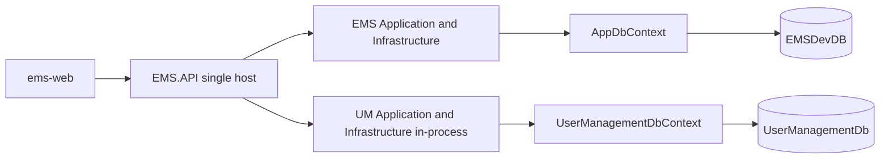

# Employee Management System (EMS)

Backend API for employee and organization directory data. The solution uses a layered structure: **Domain** (entities, EF Core context, migrations), **Application** (DTOs, services, mapping), **Infrastructure** (repository implementations), and **API** (HTTP endpoints, hosting).

**Architecture, patterns, and methods (shared across projects):** [docs/ARCHITECTURE_AND_PATTERNS.md](docs/ARCHITECTURE_AND_PATTERNS.md). For an EMS-only diagram and request flow, see [docs/architecture.md](docs/architecture.md). For business goals, personas, and capability scope, see [docs/business-perspective.md](docs/business-perspective.md). For a step-by-step guide to using the web app (HR, admins, employees), see [docs/END_USER_GUIDE.md](docs/END_USER_GUIDE.md).

## Prerequisites

- [.NET 9 SDK](https://dotnet.microsoft.com/download)
- [SQL Server](https://www.microsoft.com/sql-server) reachable from your machine (LocalDB, Docker, or a named instance)
- Optional: MongoDB if you want Serilog’s MongoDB sink and the related health check (see connection strings below)

## Solution structure

| Project | Role |
|---------|------|
| `EMS.Domain` | EF Core `AppDbContext`, entity configurations, migrations, repository interfaces |
| `EMS.Application` | DTOs grouped by area under `DTOs/{Employee,Organization,Department,Location,JobPosition}/`, application services, entity ↔ DTO mapping |
| `EMS.Infrastructure` | `BaseRepository<T>` and other infrastructure implementations |
| `EMS.API` | ASP.NET Core host, controllers, DI wiring, Serilog, health checks |
| `ems-web` | Next.js (App Router) frontend — [quick start](ems-web/README.md), [full frontend guide](ems-web/docs/FRONTEND.md) |

Cursor rules for layering and naming live in [`.cursor/rules/`](.cursor/rules/).

## Single-host architecture

There is **one deployable ASP.NET Core process: `EMS.API`**. User Management is composed **in-process** as a separate bounded context (its own `UserManagementDbContext`, EF migrations, application services, and controllers served from the same host). The two bounded contexts keep **two separate SQL databases** — `EMSDevDB` (`AppDbContext`) and `UserManagementDb` (`UserManagementDbContext`). There is no message broker; cross-database reliability uses the existing EMS database outbox. `Pukar.Usermanagement.Host` is no longer required at runtime.



## Authentication

The single host **issues** user JWTs at **`/api/auth/login`** and **validates** those same tokens in-process for protected EMS endpoints (no remote JWKS fetch). EMS endpoints require an `Authorization: Bearer <token>` header except **`/api/auth/*`** (login, register, refresh, revoke, forgot/reset password), invitation acceptance, `/.well-known/jwks.json`, and **`/health`**. OpenAPI (`/openapi/v1.json`) is anonymous in Development only.

User accounts and roles are owned by the User Management bounded context and seeded from `EMS.API` (composition root) via the opt-in `SeedAdmin` configuration. EMS stores employee data and links employees to User Management accounts through `ExternalIdentityKey`. Every successfully created employee is automatically provisioned an inactive UM account + invitation through the `ProvisionEmployeeIdentity` outbox message.

The **ems-web** client signs in at **`/login`** and stores tokens in the browser. Point only `NEXT_PUBLIC_EMS_API_BASE_URL` at `EMS.API` — auth, users, roles, and invitations are all served by the same origin (see [ems-web/README.md](ems-web/README.md)). `NEXT_PUBLIC_USER_MANAGEMENT_API_BASE_URL` is retained only as a temporary backward-compatible fallback.

## Docker Compose (SQL Server, MongoDB, Redis, Mongo Express, Next.js)

- **[docker-compose.yml](docker-compose.yml)** — infrastructure plus **`ems-web`** (production Next.js image on port **3000**).
- **[docker-compose.env.example](docker-compose.env.example)** — optional copy to **`.env`** beside `docker-compose.yml` to override `NEXT_PUBLIC_*` build args for the web image.
- **Batch (Windows):** double-click **[start-ems-docker.bat](start-ems-docker.bat)** to build and start containers; **[stop-ems-docker.bat](stop-ems-docker.bat)** runs `docker compose down` (containers removed; volumes kept).

**Typical flow:** start Docker Desktop → run `start-ems-docker.bat` → start **EMS.API** on the host (`dotnet run --project EMS.API --launch-profile http`) so the browser can reach the API at `http://localhost:5246` while the UI is at `http://localhost:3000`. Ensure [CORS](EMS.API/Program.cs) allows your web origin.

## Configuration

Connection strings and other settings live under `EMS.API` (`appsettings.json`, `appsettings.Development.json`).

| Key | Purpose |
|-----|---------|
| `ConnectionStrings:DefaultConnection` | SQL Server for EMS `AppDbContext` → `EMSDevDB` (required) |
| `ConnectionStrings:UserManagementDb` | SQL Server for `UserManagementDbContext` → `UserManagementDb` (required; must not equal `DefaultConnection`) |
| `Jwt:Issuer` / `Jwt:Audience` | Token issuer/audience (`Pukar.Usermanagement` / `ems`) |
| `Jwt:SigningKey` | Symmetric signing key (32+ chars) used to both issue and validate tokens; keep in User Secrets/env |
| `Smtp:*` | Invitation / password-reset email delivery |
| `SeedAdmin:*` | Opt-in admin seed (`Enabled=false` and `ResetExistingPassword=false` by default) |
| `ConnectionStrings:MongoLogs` | Optional; enables Serilog MongoDB sink and MongoDB health check when set |

For local development, prefer [User Secrets](https://learn.microsoft.com/aspnet/core/security/app-secrets) so credentials are not committed:

```bash
cd EMS.API
dotnet user-secrets init
dotnet user-secrets set "ConnectionStrings:DefaultConnection" "YOUR_SQL_CONNECTION_STRING"
```

Replace placeholders in `appsettings*.json` with your own values for any environment you use.

## Database migrations

**Before** `dotnet ef` or a **full rebuild** of **EMS.API**: **stop the running API** (stop debugging, close the `dotnet run` terminal, or run `powershell -NoProfile -File scripts\stop-ems-api.ps1`). If **EMS.API.exe** is still running, MSBuild usually fails with **MSB3027 / MSB3021** (“cannot copy … file is being used by another process”) because it locks DLLs under `EMS.API\bin\Debug\net9.0\`.

There are **two migration histories**, one per bounded context, kept in their respective Domain projects. Apply them using **`EMS.API` as the startup project** (so configuration loads from one place). Apply **User Management first**, then **EMS**.

PowerShell (note the backtick line-continuation):

```powershell
# User Management → UserManagementDb
dotnet ef database update `
  --project Pukar.Usermanagement/Pukar.Usermanagement.Domain `
  --startup-project EMS.API `
  --context UserManagementDbContext

# EMS → EMSDevDB
dotnet ef database update `
  --project EMS.Domain `
  --startup-project EMS.API `
  --context AppDbContext
```

> **Destructive migration (manual approval required):** `20260719091637_RemoveLegacyUserManagementTables` drops the legacy `[um]` schema from `EMSDevDB` and is **irreversible**. It is operator-gated: it performs no drop unless the marker table `[emp].[_UmLegacyDropApproved]` exists. Do **not** create that marker or run this cleanup until database-split validation and a verified backup are complete.

If the web app shows **Could not load organization** and the API logs report SQL **`Invalid column name`** (for example on `Description`, `LogoRelativePath`, or `Motto`), your database is behind the code: run the command above so pending migrations apply. If `dotnet ef` still fails to **build** after stopping the API, run `dotnet build EMS.Domain` then `dotnet ef database update --project EMS.Domain --startup-project EMS.API --no-build`.

Add a new migration after model changes:

```bash
dotnet ef migrations add YourMigrationName --project EMS.Domain --startup-project EMS.API
```

Design-time: `AppDbContextFactory` in `EMS.Domain` resolves `DefaultConnection` from `EMS.API` appsettings when the EF tools run.

## Run the API

From the repository root:

```bash
dotnet run --project EMS.API
```

Launch URLs and profiles are defined in `EMS.API/Properties/launchSettings.json` (for example, the **`http`** profile serves HTTP at `http://localhost:5246`, and **`https`** adds `https://localhost:7056`).

## Run the API and Next.js frontend together

You can start **EMS.API** and the **Next.js** dev server in one terminal using [concurrently](https://www.npmjs.com/package/concurrently) (installed under **`ems-web`**). Run **`npm install`** inside **`ems-web`** first so dependencies exist.

From the **solution root** (same folder as `EmployeeManagementSystem.sln`):

```bash
cd ems-web
npm install
cd ..
cp ems-web/.env.example ems-web/.env.local   # Windows: copy ems-web\.env.example ems-web\.env.local
npm run dev:all
```

Or from **`ems-web`** only:

```bash
cd ems-web
npm install
cp .env.example .env.local   # Windows: copy .env.example .env.local
npm run dev:all
```

Set `NEXT_PUBLIC_EMS_API_BASE_URL` and `NEXT_PUBLIC_USER_MANAGEMENT_API_BASE_URL` in `.env.local` to match the API profiles you use (see the table below). On first launch with an empty `org.Organizations` table, the web app prompts for **organization setup** at `/setup` before the main navigation is available. The API enforces **at most one** organization per database on create.

| npm script (from **solution root** or **`ems-web`**) | What it runs |
|------------------------------------------------------|----------------|
| `npm run dev:all` | User Management Host, EMS.API (`http` profiles), and `next dev`. Point `NEXT_PUBLIC_EMS_API_BASE_URL` at `http://localhost:5246` and `NEXT_PUBLIC_USER_MANAGEMENT_API_BASE_URL` at `http://localhost:5137`. |
| `npm run dev:https` | Same with **`https`** profiles. Use matching HTTPS origins in `.env.local` if you call the APIs over HTTPS. |
| `npm run dev:api` | API only (`http` profile). |
| `npm run dev` | Next.js only (expects the API to be running separately). |

Ensure [CORS](EMS.API/Program.cs) allows your web origin (for example `http://localhost:3000`). If `npm run dev:all` reports that port 3000 is already in use, stop the other Next.js process or free that port.

More detail: [ems-web/README.md](ems-web/README.md).

## API documentation (OpenAPI)

In the **Development** environment, the OpenAPI document is exposed for tooling (e.g. import into Postman or an OpenAPI viewer):

- Document URL: `/openapi/v1.json` (default for ASP.NET Core 9 OpenAPI)

There is no Swagger UI in this template; you can add one later (e.g. Swashbuckle or Scalar) if you want interactive docs in the browser.

## HTTP endpoints (current)

REST-style CRUD under `api/{resource}`:

| Resource | Base route |
|----------|------------|
| Employees | `GET/POST /api/Employees`, `GET/PUT/DELETE /api/Employees/{id}` |
| Manager team | `GET /api/Manager/team?organizationId={id}&managerId={id}` — direct reports, summary counts, and operational indicators for the scoped manager |
| Organizations | `GET/POST /api/Organizations`, `GET/PUT/DELETE /api/Organizations/{id}` |
| Departments | `GET/POST /api/Departments`, `GET/PUT/DELETE /api/Departments/{id}` |
| Locations | `GET/POST /api/Locations`, `GET/PUT/DELETE /api/Locations/{id}` |
| Job positions | `GET /api/JobPositions?organizationId={id}`, `GET/POST/PUT/DELETE /api/JobPositions/{id}` |
| Documents | `GET /api/Documents/types`, `GET /api/Documents?employeeId={id}`, `GET/PUT/DELETE /api/Documents/{id}`, `POST /api/Documents` (multipart: file + metadata), `GET /api/Documents/{id}/file` (download). PDF, Word, or images; files under `wwwroot/uploads/documents/`. `EmployeeId` on a document is nullable for future associations. |
| Notifications | `GET /api/Notifications`, `GET /api/Notifications/unread-count`, `POST /api/Notifications/{id}/read`, `POST /api/Notifications/read-all` — see [docs/notifications.md](docs/notifications.md) |

**Employees** may reference an optional **`jobPositionId`** (nullable) pointing at a row in **`org.JobPositions`**. Job positions are scoped per organization (`organizationId` on create; title and optional code are unique within the org). This replaces an older two-level Role/Job model so the name **JobPosition** stays distinct from application **user roles** (e.g. identity/authorization).

**Health:** `GET /health` (includes database; MongoDB when `MongoLogs` is configured).

## Building

From the repository root (same folder as `EmployeeManagementSystem.sln`):

```bash
dotnet build EmployeeManagementSystem.sln
```

Release configuration:

```bash
dotnet build EmployeeManagementSystem.sln -c Release
```

## Tests

Automated tests are not included yet. When you add a test project, document the `dotnet test` command here.
