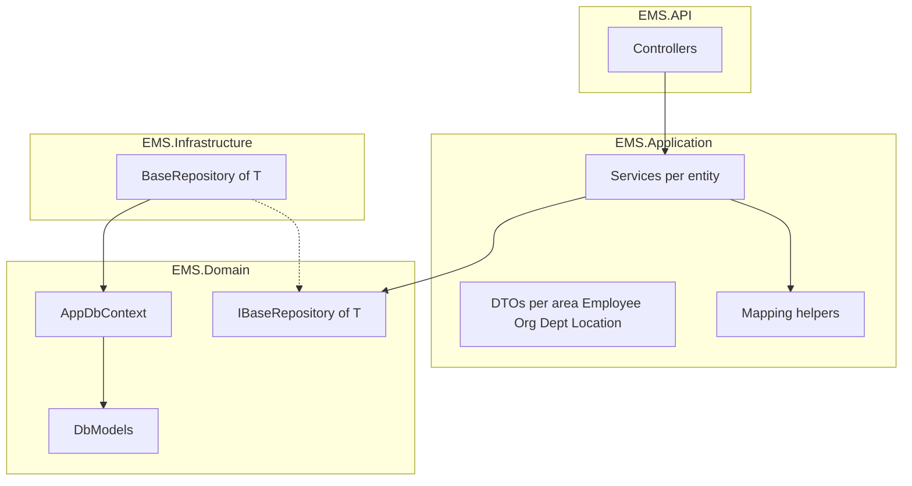
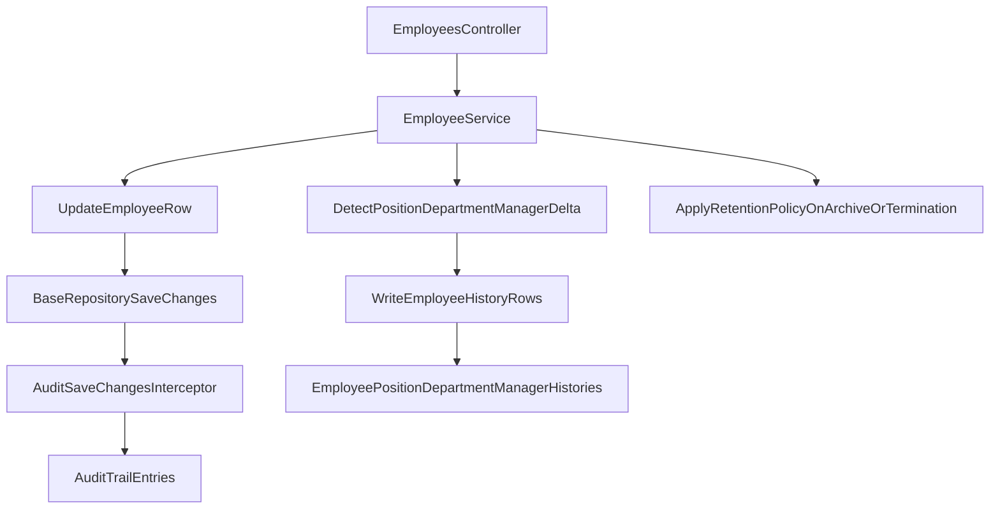

# EMS architecture (overview)

This document is the **EMS-focused** map: diagrams and how requests flow through this solution today. The **canonical guide** for layering, naming, `Pukar.Shared`, `Pukar.Usermanagement`, frontend, Git, and checklists—reusable across **all** projects—is [ARCHITECTURE_AND_PATTERNS.md](ARCHITECTURE_AND_PATTERNS.md). For business goals, personas, capability scope, and roadmap context, see [business-perspective.md](business-perspective.md). Expand this file when you add authentication, validation pipelines, or deployment-specific concerns that are specific to EMS.

## Layering

## Responsibility split

- **Controllers** accept HTTP requests and return DTOs; they do not reference EF Core or `DbContext` directly.
- **Application services** orchestrate use cases: load or create entities via `IBaseRepository<T>`, map to/from DTOs, call `SaveChangesAsync` through the repository.
- **Mappers** (static helpers in `EMS.Application/Mapping`) keep mapping logic in one place per aggregate.
- **Domain** owns persistence model, EF configuration, and migrations; **Infrastructure** implements `IBaseRepository<T>` using `AppDbContext`.

## DTO conventions

- DTOs live under `EMS.Application/DTOs` grouped by business area (e.g. `Employee/`, `Organization/`, `Department/`, `Location/`). Each folder holds that area’s create/update request models and response model(s); add more types to the same folder when new tables relate to that area.
- **Create** and **Update** use separate request types (`Create*RequestModel`, `Update*RequestModel`).
- **Read** uses `*ResponseModel` for both detail and list (list is the same shape repeated).
- Namespaces match folders: `EMS.Application.DTOs.Employee`, `EMS.Application.DTOs.Organization`, etc.
- DTOs contain scalars and enums only (no navigation properties); foreign keys are expressed as `int` / nullable `int` as appropriate.

## Dependency injection

Registrations live in `EMS.API/Program.cs`: open-generic `IBaseRepository<>` → `BaseRepository<>`, plus scoped application services per entity area.

## Recent EMS changes

- **Navigation duplicate guard:** navigation output now includes backend dedupe protection for effective parent+route+label duplicates before tree serialization.
- **Sidebar safety:** frontend sidebar applies a defensive dedupe pass on navigation payload prior to rendering menu entries.
- **Permission UX:** menu permissions are now managed as a collapsible tree under user management with tri-state selection and per-branch bulk actions.
- **RBAC seed hardening:** startup seed logic now checks logical parent+route matches in addition to key checks to avoid duplicate logical menu rows.
- **Employee provisioning password rule:** initial linked-user password is generated as `FirstName@123` with fallback `EMP{EmployeeNumber}@123`; forced password change remains enabled for new users.
- **Historical tracking:** employee changes now write effective-dated history rows for position, department, and manager transitions.
- **Automatic audit trail:** persistence-level save interception records who changed what and when for tracked entity changes.
- **Retention-safe employee deletion:** employee delete API behavior archives records (`IsArchived`) and computes `RetentionUntilUtc` from policy instead of hard delete.

## Historical tracking flow

