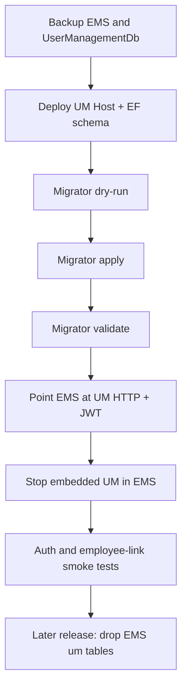

# EMS ↔ User Management database split cutover

Safe rollout for moving User Management data out of the EMS database into a dedicated `UserManagementDb`.

**Do not drop or truncate source `um.*` tables during the initial cutover.** Keep them until a later release after a soak period.

## Tool

`tools/UmDbSplitMigrator` is an idempotent console migrator with four modes:

| Mode | Purpose |
|------|---------|
| `dry-run` | Print the migration plan and source preflight checks; no writes |
| `apply` | Copy UM data, migrate active invitations, backfill role keys; then validate |
| `validate` | Run full cutover checks; exit `1` on any failure |
| `rollback` | Remove migrated rows from `UserManagementDb` and restore RoleKey snapshots (requires `--confirm`) |

```bash
dotnet run --project tools/UmDbSplitMigrator -- --mode dry-run \
  --source "Server=...;Database=EMSDevDB;..." \
  --target "Server=...;Database=UserManagementDb;..."

dotnet run --project tools/UmDbSplitMigrator -- --mode apply \
  --source "Server=...;Database=EMSDevDB;..." \
  --target "Server=...;Database=UserManagementDb;..."

dotnet run --project tools/UmDbSplitMigrator -- --mode validate \
  --source "Server=...;Database=EMSDevDB;..." \
  --target "Server=...;Database=UserManagementDb;..."

dotnet run --project tools/UmDbSplitMigrator -- --mode rollback --confirm \
  --source "Server=...;Database=EMSDevDB;..." \
  --target "Server=...;Database=UserManagementDb;..."
```

Connection strings may also be supplied via `EMS_SOURCE_CONNECTION` / `UM_TARGET_CONNECTION`.

### What `apply` copies

From the EMS database into `UserManagementDb` (preserving primary key values):

- `um.Users`
- `um.Roles`
- `um.UserRoles`
- `um.RefreshTokens`
- relevant `dbo.__EFMigrationsHistory` rows for User Management migrations

Active invitations from `emp.EmployeeInvitations` are inserted into `um.AccountInvitations` with:

- `ExternalCorrelationId = employee:{employeeId}`
- recipient email / display name from `org.Employees`
- only rows that are unused, unrevoked, and not expired

EMS role references are backfilled in place:

- `org.PositionRoles.RoleKey`
- `org.EmployeeRoleAssignments.RoleKey`

Numeric legacy values (former `RoleId`) become `um.Roles.NormalizedName`. Previous values are stored in `ems._RoleKeyBackfillSnapshot` for rollback.

Source `um.*` tables are **not** deleted.

## Validation checks

`validate` (and post-`apply`) asserts:

- user counts match
- role counts match
- user-role assignment counts match
- all source user/role IDs exist on the target (identity preservation for `Employee.ExternalIdentityKey`)
- active employee identity links resolve to target users
- no duplicate emails on either side
- no duplicate active `ExternalIdentityKey` values
- refresh-token totals and active (non-revoked, non-expired) counts match; no orphan tokens
- pending invitation counts match (`employee:{id}` on target)
- no unknown or still-numeric role keys on EMS position/assignment rows
- all UM EF migration IDs are present on the target

## EMS EF migration phases (EmployeeInvitations)

| Phase | Migration | Action |
|-------|-----------|--------|
| A — preparation | `20260703083655_DropEmployeeInvitations` | Creates `emp._UmSeparationCutoverMarker` only; **does not drop** `emp.EmployeeInvitations` |
| B — data copy | `tools/UmDbSplitMigrator apply` | Copies active invitations to `um.AccountInvitations`; backfills role keys |
| C — post-soak cleanup | `20260705073448_DropEmployeeInvitationsAfterSoakPeriod` | Drops `emp.EmployeeInvitations` and cutover marker after validation soak |

Run EMS EF migrations through phase A before the migrator. Apply phase C only after soak and successful `validate`.

## Cutover sequence

1. **Back up both databases** (EMS and empty/target `UserManagementDb`).
2. **Deploy User Management host** (`Pukar.Usermanagement.Host`) pointed at `UserManagementDb`.
3. **Create schema on the target** (empty data — disable `SeedAdmin` until after migrate, so identity values are not consumed):

   ```bash
   dotnet ef database update \
     --project Pukar.Usermanagement/Pukar.Usermanagement.Domain \
     --startup-project Pukar.Usermanagement/Pukar.Usermanagement.Host \
     --context UserManagementDbContext
   ```

4. **Dry-run** the migrator and fix any preflight failures.
5. **Apply** the migrator.
6. **Validate** (re-run if needed until all checks pass).
7. **Configure EMS HTTP integration and JWT validation** (`UserManagementApi` in EMS appsettings; JWKS from UM host). See [ems-um-http-integration.md](ems-um-http-integration.md).
8. **Stop embedded User Management hosting** in EMS (EMS must not open `UserManagementDbContext` or serve UM controllers).
9. **Smoke tests**
   - Login / refresh / revoke against UM host
   - EMS API call with UM-issued JWT
   - Employee invite / accept with `employee:{id}` correlation
   - Employee activate/deactivate and role sync via internal APIs
10. **Soak**, then apply EMS migration **`DropEmployeeInvitationsAfterSoakPeriod`** and, in a **later release**, remove obsolete `um` tables from the EMS database.



## Rollback

Prefer restoring both databases from the pre-cutover backups.

Tool-assisted rollback (`--mode rollback --confirm`):

- restores EMS `RoleKey` values from `ems._RoleKeyBackfillSnapshot`
- deletes target `um.AccountInvitations` with `employee:%` correlation IDs
- deletes target users/roles/user-roles/refresh-tokens that exist on the source by ID
- **does not** delete source EMS `um.*` data

After rollback, point EMS back at the co-located UM configuration only if that build is still deployed.

## Later release: remove old `um` tables

Only after production soak and confidence that no process reads EMS-local `um.*`:

1. Confirm EMS has no `UserManagementDbContext` / UM repository usage.
2. Confirm backups exist.
3. Drop `um` schema objects from the EMS database in a dedicated migration/release.
4. Drop helper tables `ems._RoleKeyBackfillSnapshot` and (on UM) `um._SplitMigrationLedger` if no longer needed.
