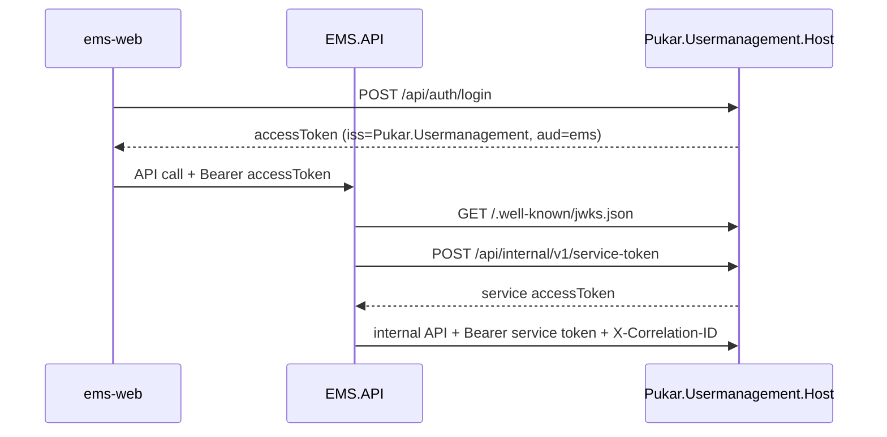

# EMS ↔ User Management HTTP integration

## Overview

EMS and Pukar.Usermanagement run as **separate hosts**. EMS validates JWTs issued by User Management and calls UM internal APIs with a service token. EMS never embeds UM controllers, never opens `UserManagementDbContext`, and never references UM implementation assemblies.



## Configuration

### EMS (`UserManagementApi`)

| Setting | Purpose |
|---------|---------|
| `BaseUrl` | UM Host origin (dev: `http://localhost:5137`) |
| `ServiceClientId` / `ServiceClientSecret` | Match UM `ServiceClients:Ems` |
| `JwtIssuer` / `JwtAudience` | Must match UM `Jwt:Issuer` / `Jwt:Audience` |
| `JwksPath` | Default `/.well-known/jwks.json` |
| `RolesMetadataPath` | Default `/api/internal/v1/roles/metadata` |
| `TimeoutSeconds`, `RetryCount`, `RetryBaseDelayMs` | HTTP client policy (retry only on safe GETs) |

Store secrets in user-secrets, environment variables, or a local `.env` file for Docker Compose. **Do not commit secrets or private keys.** Any secret previously committed to git must be treated as compromised and rotated.

### Local secret provisioning

| Secret | Local source |
|--------|----------------|
| SQL / Mongo / Redis passwords | `docker-compose.env.example` → copy to `.env` |
| `EMS_UM_SERVICE_CLIENT_SECRET` | Same value in EMS `UserManagementApi:ServiceClientSecret` and UM `ServiceClients:Ems:Secret` |
| JWT RSA private key | `dotnet run --project Pukar.Usermanagement/tools/GenRsaKey -- ./secrets/dev-rsa-key.pem` (gitignored) |
| EMS CORS | `Cors:AllowedOrigins` in EMS appsettings or `Cors__AllowedOrigins__*` env vars |

Docker Compose: `cp docker-compose.env.example .env`, edit placeholders, then `docker compose up -d --build`.

## Internal API idempotency (User Management)

All mutating internal endpoints require an `Idempotency-Key` header. User Management persists `(client id, route, key, request fingerprint, status, response)` and:

- returns the original response for a valid replay with the same payload
- returns **409 Conflict** when the same key is reused with a different payload
- expires records after 24 hours (hourly cleanup job)

EMS continues to send idempotency keys from `UserManagementHttpClient`; enforcement is on the UM host.

## Service authentication

| Behaviour | Detail |
|-----------|--------|
| Invalid client credentials | **401 Unauthorized** (not 400) |
| Token issuance | Rate-limited (30/min per client id) |
| Secret rotation | `ServiceClientSeedHostedService` updates hash when `ServiceClients:Ems:Secret` changes |
| Role metadata | Requires `roles.read` scope (least privilege) |
| User JWT on internal routes | Rejected (service token scheme only) |

## Invitation security

- Invitations **never** deactivate or reset passwords on existing active accounts.
- Existing emails return **409 Conflict** unless `LinkExistingInactiveUserId` is supplied for an explicit inactive account link (EMS passes `ExternalIdentityKey` when re-inviting a linked employee).
- Administrator accounts cannot be invited or activated via invitation accept.
- Password minimum length is **12** via central `PasswordPolicy` (invitation accept and UI).
- Accept/resend/revoke use optimistic concurrency (`RowVersion`) on `um.AccountInvitations`.

## Role migration readiness (EMS)

- `GET /health/ready` includes `role-key-migration` — unhealthy while numeric legacy `RoleKey` values remain.
- Role mutations (`SetPositionRoles`, `SetDirectRoles`) are blocked until backfill completes.
- Production/staging startup fails if `RoleKeyBackfillHostedService` cannot resolve legacy keys (Development logs only).
- Recovery: run `tools/UmDbSplitMigrator` apply/validate or ensure UM role metadata is reachable, then restart EMS.

### ems-web

| Variable | Purpose |
|----------|---------|
| `NEXT_PUBLIC_EMS_API_BASE_URL` | EMS.API (e.g. `http://127.0.0.1:5246`) — `emsHttpClient` |
| `NEXT_PUBLIC_USER_MANAGEMENT_API_BASE_URL` | UM Host (e.g. `http://127.0.0.1:5137`) — `userManagementHttpClient` |

Legacy aliases `NEXT_PUBLIC_API_BASE_URL` / `NEXT_PUBLIC_UM_API_BASE_URL` are still accepted as fallbacks.

## Local development

```bash
cd ems-web
npm run dev:all
```

Starts UM Host (http), EMS.API (http), and Next.js.

Health:

- EMS liveness: `GET /health`
- EMS readiness (includes UM): `GET /health/ready`
- UM: `GET /health`

## Database split cutover

When User Management data still lives in the EMS database (`um` schema), use the migrator and runbook in [ems-um-db-split-cutover.md](ems-um-db-split-cutover.md) before pointing EMS at a dedicated `UserManagementDb`. Initial cutover copies data only; source `um` tables are removed in a later release.

## Data ownership

| Concern | Owner |
|---------|-------|
| Employee HR data, org, positions | EMS |
| `PositionRole.RoleKey`, `EmployeeRoleAssignment.RoleKey` | EMS (stable keys = UM `NormalizedName`) |
| `RoleKeyPermission`, `RoleKeyCapability`, menus | EMS |
| Integration outbox | EMS |
| Users, roles, invitations, passwords, sessions, SMTP | User Management |
| `Employee.ExternalIdentityKey` | EMS (stores UM user id as string) |

## Invitation flow

1. EMS validates employee eligibility (not archived, has email).
2. EMS `POST /api/internal/v1/invitations` with `externalCorrelationId=employee:{id}`.
3. UM creates/sends invitation and returns `userId`.
4. EMS stores `ExternalIdentityKey = userId`.
5. Invitee accepts via UM `POST /api/invitations/accept` (ems-web uses `userManagementHttpClient` / `authService.acceptInvitation`).

## Degradation rules

| Operation | UM unavailable |
|-----------|----------------|
| Employee directory enrichment | Continue without linked-user details |
| Role metadata | Empty catalog / cached values; writes may fail validation |
| Invite, activate, deactivate, role sync, revoke | **503** `user_management_unavailable` — never silent success |
| Outbox | Stay `Pending`, backoff retry, keep `IdempotencyKey` |

## Architecture enforcement

`EMS.ArchitectureTests` asserts Domain/Application/API/Infrastructure do not reference `Pukar.Usermanagement.API|Application|Domain|Infrastructure|Host`. Only `Pukar.Usermanagement.Contracts` (and `Pukar.Shared`) are allowed.
