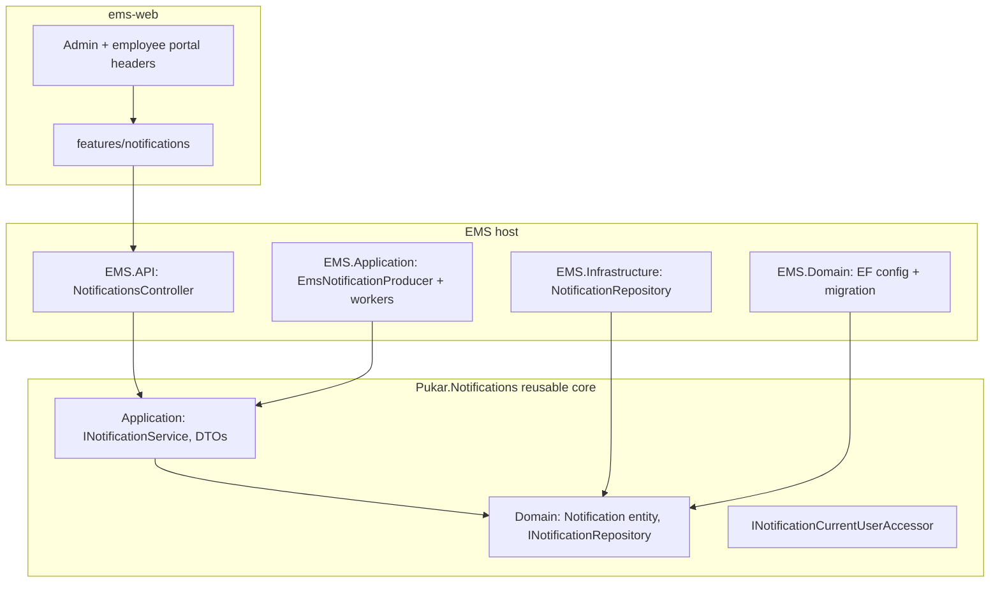

# Notification Center

EMS includes a reusable in-app Notification Center for authenticated users. The feature is split into a **portable core** (`Pukar.Notifications`) and **EMS-specific producers** that create notifications when workforce events occur.

## Architecture

### Reusable core (copy to another .NET project)

| Project / folder | Responsibility |
|------------------|----------------|
| `Pukar.Notifications.Domain` | `Notification` entity, `NotificationSeverity`, `INotificationRepository` |
| `Pukar.Notifications.Application` | DTOs, `INotificationService`, `NotificationService`, `INotificationCurrentUserAccessor` |

The core has **no dependency** on EMS entities (`Employee`, `TaskItem`, `LeaveRequest`, etc.).

### EMS host adapters

| Location | Responsibility |
|----------|----------------|
| `EMS.Domain/Database/Configurations/NotificationConfiguration.cs` | EF mapping to `ntf.Notifications` |
| `EMS.Infrastructure/Repositories/Implementations/NotificationRepository.cs` | `INotificationRepository` implementation |
| `EMS.API/Services/HttpContextNotificationCurrentUserAccessor.cs` | Resolves UM user id from JWT `sub` |
| `EMS.API/Controllers/NotificationsController.cs` | HTTP endpoints |
| `EMS.Application/Services/Notifications/*` | EMS producers, type keys, recipient resolver |
| `EMS.API/Bootstrap/ScheduledChangeReminderWorker.cs` | Upcoming scheduled change reminders |
| `EMS.API/Bootstrap/DocumentExpiryNotificationWorker.cs` | Document expiry reminders |

### EMS-specific producers

`IEmsNotificationProducer` / `EmsNotificationProducer` builds human-readable titles, bodies, action URLs, metadata JSON, and dedupe keys. Producers resolve recipients via `Employee.ExternalIdentityKey` → UM `UserId`. If an employee is not linked to a UM user, **no notification is created**.

| Type key | Trigger | Recipient |
|----------|---------|-----------|
| `task.assigned` | `TaskService.CreateAsync` | Assignee |
| `leave.submitted` | `LeaveRequestService.CreateAsync` | Employee's manager |
| `leave.approved` | *Ready; wire when leave approval workflow is added* | Requesting employee |
| `leave.rejected` | *Ready; wire when leave approval workflow is added* | Requesting employee |
| `employee.invitation.failed` | `HttpEmployeeInvitationService.SendAsync` | HR user who sent invite |
| `employee.scheduled_change.upcoming` | `ScheduledChangeReminderWorker` | Affected employee + manager |
| `document.expiring` | `DocumentExpiryNotificationWorker` | Linked employee |

Producer failures are logged and **do not block** the originating business transaction.

## Recipient model

Primary inbox key: **UM `UserId`** (JWT `sub` claim). Optional `RecipientKey` exists on the entity for other products; EMS v1 uses `RecipientUserId` only.

## API endpoints

All routes require `Authorization: Bearer <token>`.

| Method | Route | Description |
|--------|-------|-------------|
| GET | `/api/Notifications` | Current user's inbox (`take`, `skip`, `unreadOnly` query params) |
| GET | `/api/Notifications/unread-count` | `{ "count": number }` |
| POST | `/api/Notifications/{id}/read` | Mark one notification read |
| POST | `/api/Notifications/read-all` | Mark all unread notifications read; returns `{ "count": number }` |

### Response shape (`NotificationResponseModel`)

- `id`, `typeKey`, `title`, `body`, `actionUrl`, `metadataJson`, `severity`, `isRead`, `createdAtUtc`, `readAtUtc`, `expiresAtUtc`

## Database

- Table: `ntf.Notifications`
- Migration: `AddNotificationCenterModule`
- Apply: `dotnet ef database update --project EMS.Domain --startup-project EMS.API`

## Frontend integration (`ems-web`)

Reusable feature folder: `ems-web/src/features/notifications/`

| Piece | Path |
|-------|------|
| Types | `types/notification.types.ts` |
| API service | `services/notificationService.ts` |
| React Query keys | `services/query-keys.ts` |
| Hooks | `hooks/useNotifications.ts`, `useUnreadNotificationCount.ts`, etc. |
| UI | `components/NotificationBell.tsx`, `NotificationDropdown.tsx`, `NotificationItem.tsx` |

### Header mount points

- Admin shell: `ems-web/src/shared/components/layout/EmsTailAdminHeader.tsx`
- Employee portal: `ems-web/src/shared/components/layout/EmployeePortalShell.tsx`

The bell shows an unread badge (polls every 60s) and a dropdown list with mark-read actions.

## Reusing in another project

### Backend

1. Copy `Pukar.Notifications/` into the solution.
2. Add `Notification` to your host `DbContext` + EF configuration + migration.
3. Implement `INotificationRepository` against your database.
4. Implement `INotificationCurrentUserAccessor` from your auth context.
5. Register `INotificationService` and `NotificationService` in DI.
6. Add a thin `NotificationsController` (or equivalent).
7. Add product-specific producer classes in **your** application layer — not in `Pukar.Notifications.*`.

### Frontend (Next.js / React)

1. Copy `ems-web/src/features/notifications/`.
2. Point `notificationService.ts` at your HTTP client (replace `@/shared/api/http-client`).
3. Mount `<NotificationBell />` in your authenticated app shell header.

## Configuration

`EmployeeScheduling` options (`appsettings.json`):

| Key | Default | Purpose |
|-----|---------|---------|
| `WorkerPollIntervalSeconds` | `60` | Background worker poll interval |
| `ScheduledChangeReminderDays` | `7` | Notify before scheduled changes within N days |
| `DocumentExpiryReminderDays` | `30` | Scan documents expiring within N days |

## Tests

- `EMS.Application.UnitTests/Notifications/NotificationServiceTests.cs` — inbox scoping, unread count, mark read, dedupe, expiry
- `EMS.Application.UnitTests/Notifications/EmsNotificationProducerTests.cs` — task/leave producer behavior

Run: `dotnet test EMS.Application.UnitTests`
