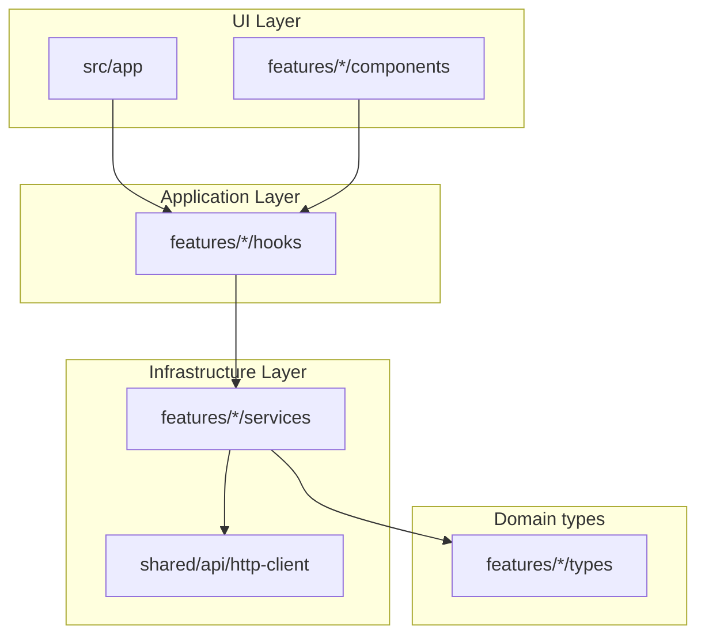

# EMS Web — Frontend documentation

This document describes the **Next.js** client in `ems-web`: architecture, configuration, and how it connects to **two independent APIs** — **EMS.API** and **Pukar.Usermanagement.Host**. For backend domains, migrations, and Docker infrastructure, see the [repository root README](../../README.md) and [ems-um-http-integration.md](../../docs/ems-um-http-integration.md).

---

## 1. Purpose

The web app is a **browser UI** for managing employees against the existing REST API. It is structured for **parallel frontend work**: clear feature folders, typed DTOs aligned with the .NET API, and no direct HTTP calls inside presentational components.

---

## 2. Technology stack

| Area | Choice |
|------|--------|
| Framework | Next.js 16 (App Router), React 19 |
| Language | TypeScript (strict) |
| Styling | Tailwind CSS v4 |
| Server/async state | TanStack React Query v5 |
| Client/UI state | Zustand |
| HTTP | Axios — `emsHttpClient` + `userManagementHttpClient` (`src/shared/api/http-client.ts`) |
| Forms & validation | react-hook-form + Zod |
| Toasts | Sonner |

---

## 3. Employee portal shell

Routes under **`/employee-portal`** (including **`/employee-portal/leave`**) render inside **`EmployeePortalShell`**: no admin sidebar, minimal header with **Main app** (to `/`), theme toggle, and user menu. Self-service leave lives at **`/employee-portal/leave`**; the main app **`/leave`** page may still show an employee picker for users whose roles include the **Leave** menu permission (`leave` menu key on the API).

---

## 4. Layered architecture (Clean / onion-style)

Layers map loosely to the backend style: **types** first, **infrastructure** (HTTP), **application** (hooks = use cases), **UI** (pages & components).



**Rules**

- **UI** imports **hooks** and **store** only; it does not import Axios or HTTP clients (except shared primitives like `getErrorMessage` / `ApiAvailabilityAlert`).
- **Hooks** call **services** and use React Query (`useQuery` / `useMutation`).
- **Services** are plain async functions: one module per feature area (e.g. `employeeService.ts`). EMS domain services use `emsHttpClient`; auth and UM admin use `userManagementHttpClient`.
- **Types** mirror API JSON (camelCase) for that feature.

---

## 5. Folder structure

```
ems-web/
├── docs/
│   └── FRONTEND.md          ← this file
├── public/                   (static assets, if any)
├── src/
│   ├── app/                  App Router: layouts, pages, global CSS
│   │   ├── layout.tsx
│   │   ├── page.tsx
│   │   ├── globals.css
│   │   └── employees/
│   │       └── page.tsx
│   ├── features/
│   │   └── employees/
│   │       ├── components/   Feature UI (table, form, dialogs)
│   │       ├── hooks/        useEmployees, mutations, etc.
│   │       ├── services/     employeeService, query-keys
│   │       ├── store/        Zustand UI store
│   │       ├── types/        TS types + Zod schemas
│   │       └── utils/        e.g. date helpers
│   ├── providers/
│   │   └── ReactQueryProvider.tsx
│   └── shared/
│       ├── api/              http-client, error helpers
│       ├── components/       Button, Modal, Spinner
│       └── utils/            cn(), etc.
├── .env.example
├── Dockerfile
├── next.config.ts
├── package.json
└── README.md
```

When you add another bounded context (e.g. departments), add `src/features/departments/` with the same shape.

---

## 6. Dual HTTP clients

| Client | Env | Owns |
|--------|-----|------|
| `emsHttpClient` | `NEXT_PUBLIC_EMS_API_BASE_URL` | Employees, directory/profile, departments, positions, sites, attendance, shifts, leave, tasks, EMS menus/capabilities, employee↔user orchestration (invite send/list/revoke, link-user, role sync) |
| `userManagementHttpClient` | `NEXT_PUBLIC_USER_MANAGEMENT_API_BASE_URL` | Login, refresh, logout/revoke, change password, invitation **acceptance**, users, roles, user-role administration |

Token renewal always calls User Management `POST /api/auth/refresh`, then retries the failed request on the **original** client (EMS or UM).

### Availability states

`classifyApiError` / `ApiAvailabilityAlert` surface:

- **EMS unavailable** — network/5xx against EMS
- **User Management unavailable** — network/5xx against UM
- **Authentication expired** — `401` (session refresh failed or rejected)
- **Identity operation pending** — EMS `503` / `user_management_unavailable` while UM is down

### Public routes

`/login`, `/change-password`, and `/accept-invitation` are reachable without an admin shell. Invitation acceptance calls User Management directly via `authService.acceptInvitation`.

---

## 7. Environment variables

### Local development (`.env.local`)

Copy `.env.example` to `.env.local` (gitignored).

| Variable | Required | Description |
|----------|----------|-------------|
| `NEXT_PUBLIC_EMS_API_BASE_URL` | Yes | EMS.API origin, **no trailing slash** (e.g. `http://localhost:5246`). |
| `NEXT_PUBLIC_USER_MANAGEMENT_API_BASE_URL` | Yes | User Management Host origin (e.g. `http://localhost:5137`). |

Legacy aliases `NEXT_PUBLIC_API_BASE_URL` and `NEXT_PUBLIC_UM_API_BASE_URL` are still read as fallbacks.

The app loads the current organization from **EMS** `GET /api/Organizations` (single-tenant: first row). If none exists, the UI routes to **`/setup`**.

`NEXT_PUBLIC_*` variables are inlined into the **browser bundle** at build time. After changing them, restart `npm run dev` or rebuild for production.

### Docker / `docker compose` build

When building the **`ems-web`** image, both `NEXT_PUBLIC_*` values are passed as **Docker build args** (browser-reachable host ports, not Docker service names). Changing them requires a **rebuild**.

---

## 8. Running locally (recommended for development)

1. Start **User Management Host** and **EMS.API** (and SQL/Mongo/Redis). Prefer `npm run dev:all` from `ems-web`.
2. Ensure **CORS** on both APIs allows `http://localhost:3000`.
3. In `ems-web`:

```bash
npm install
cp .env.example .env.local   # set both API origins
npm run dev:all
```

Open **http://localhost:3000**.

**Node.js:** Next.js 16 expects **Node ≥ 20.9** (`package.json` `engines`).

---

## 9. Docker Compose (full stack)

From the **solution root**:

```bash
docker compose up -d --build
```

Services:

| Service | Port | Role |
|---------|------|------|
| `sqlserver` | 1433 | Shared instance; databases `EMSDevDB` and `UserManagementDb` |
| `mongodb` / `redis` | 27017 / 6379 | EMS supporting stores |
| `usermanagement-api` | 5137 | Identity host |
| `ems-api` | 5246 | EMS.API (calls UM over the Docker network) |
| `ems-web` | 3000 | Next.js UI |

`next.config.ts` sets `output: "standalone"` for the `Dockerfile` entrypoint (`node server.js`).

---

## 10. API alignment (Employees)

The client targets the same contracts as the backend:

| Method | Path | Notes |
|--------|------|--------|
| GET | `/api/Employees` | List |
| GET | `/api/Employees/{id}` | Detail |
| POST | `/api/Employees` | Create body matches create DTO |
| PUT | `/api/Employees/{id}` | Update |
| DELETE | `/api/Employees/{id}` | 204 on success |

Types live under `src/features/employees/types/`. Field names follow **camelCase** JSON (ASP.NET Core default). There is no `salary` field; job linkage is `jobPositionId` where applicable.

---

## 11. React Query conventions

- **Query keys** are centralized in `src/features/employees/services/query-keys.ts` (e.g. `['employees']`, `['employees', 'detail', id]`).
- **Mutations** invalidate list queries (and detail when updating) so lists stay fresh.
- **ReactQueryProvider** configures `QueryClient` defaults and mounts **React Query Devtools** in development (bottom-left) and **Sonner** toasts.

---

## 12. Zustand (UI-only state)

`src/features/employees/store/employee-ui-store.ts` holds **modal visibility**, **selected row for edit/delete**, and **form mode** (create vs edit). It does **not** perform HTTP; mutations stay in hooks.

---

## 13. Quality checks

```bash
npm run lint
npm run test
npm run build
```

`npm run test` asserts authentication, users, roles, password, and invitation-acceptance traffic never targets EMS.API. `npm run build` must succeed before relying on the Docker image.

---

## 14. Troubleshooting

| Symptom | Likely cause | What to try |
|---------|----------------|-------------|
| Overlay: “Error evaluating Node.js code” / `globals.css` | Tailwind v4 native binary missing (`@tailwindcss/oxide`) | Remove `node_modules` and `package-lock.json`, `npm install`, then `npm run build` again. |
| Network / CORS errors | API down or wrong public base URLs | Confirm both EMS and UM origins in browser devtools; ensure CORS on **both** hosts includes `http://localhost:3000`. |
| “User Management unavailable” on login | UM Host down or wrong `NEXT_PUBLIC_USER_MANAGEMENT_API_BASE_URL` | Start UM (`npm run dev:um`) and verify port `5137`. |
| “EMS unavailable” after login | EMS.API down or wrong `NEXT_PUBLIC_EMS_API_BASE_URL` | Start EMS (`npm run dev:api`) and verify port `5246`. |
| “Identity operation pending” | EMS cannot reach UM for invite/link/role sync | Check EMS `UserManagementApi:BaseUrl` and UM health. |
| `401` / authentication expired | Refresh token invalid or UM refresh failed | Sign in again; confirm UM refresh endpoint. |
| Docker web image stale env | `NEXT_PUBLIC_*` baked at **build** | Rebuild image: `docker compose build --no-cache ems-web`. |

---

## 15. Related documentation

| Document | Content |
|----------|---------|
| [ems-web/README.md](../README.md) | Short quick start in `ems-web` |
| [Root README](../../README.md) | Backend solution, Docker Compose overview, EMS.API |
| [docker-compose.env.example](../../docker-compose.env.example) | Optional Compose overrides for web build args |

---

## 16. Conventions checklist (new feature)

1. Add **types** under `features/<name>/types/`.
2. Add **service** functions using **`emsHttpClient`** (EMS domain) or **`userManagementHttpClient`** (identity/admin). Never send auth/users/roles/password/invitation-accept to EMS.
3. Add **query keys** and **hooks** (`useQuery` / `useMutation`).
4. Add **components**; wire **pages** under `src/app/`. Prefer `ApiAvailabilityAlert` for load failures.
5. Keep **env-specific** URLs in `.env.local` / Compose build args, not hard-coded in components.

---

## 17. Recent UI updates

### Sidebar navigation

- Sidebar rendering now applies a defensive dedupe pass to API menu data before mapping items to UI entries.
- Dedupe identity is based on effective parent and normalized route/label to prevent duplicate visible items (e.g. duplicate `Menu access`).

### Menu access management

- `User management > Menu access` now uses a tree structure instead of a flat table.
- Tree behavior includes:
  - recursive parent-child rendering from `parentMenuId`
  - branch expand/collapse
  - tri-state checkbox status for partial selections
  - branch-level `Select all` / `Clear all`
- Save flow remains compatible with existing backend API and still includes parent expansion logic before submit.
